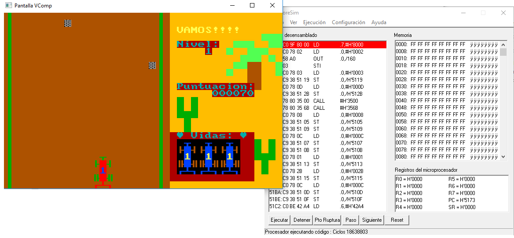

# pipero-dakar

Pequeño programa en ensamblador basandose en un emulador desarrollado por cierto profesor que impartió
clase en la Universidad Pública de Navarra (UPNA) que guardo con afecto.

Pipero dakar es un juego de coches con colisión y ciertas movidas pseudoaleatorias.

